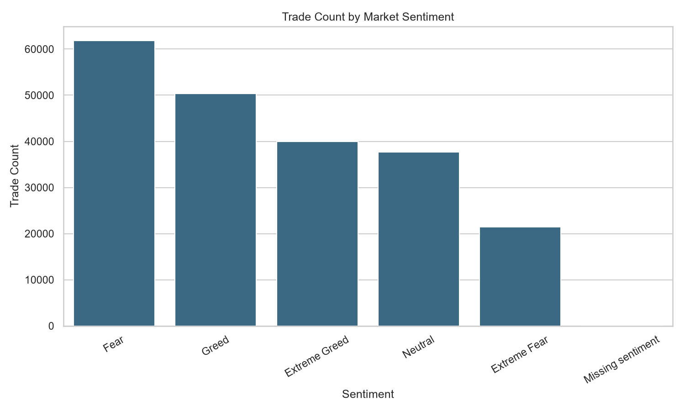
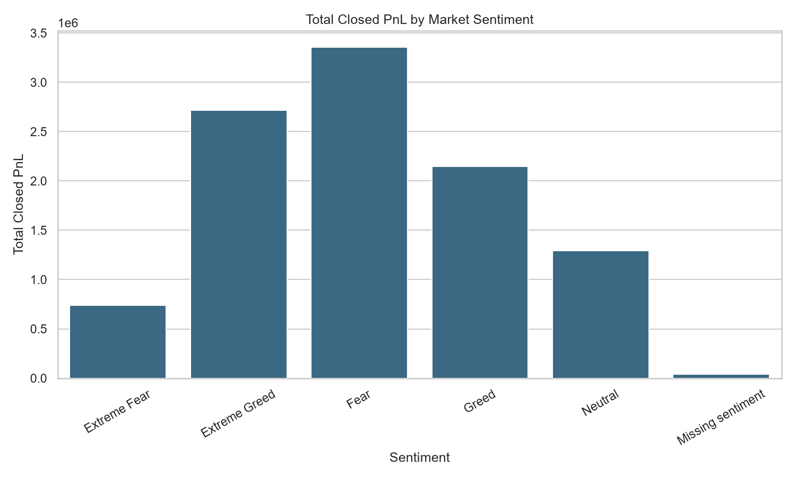
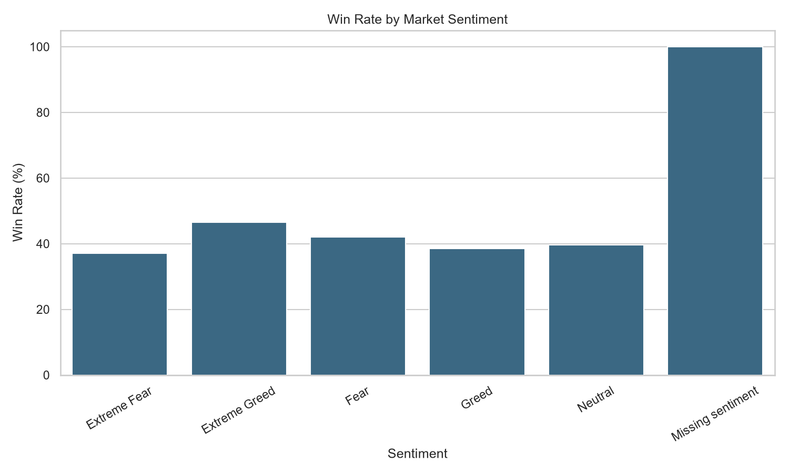
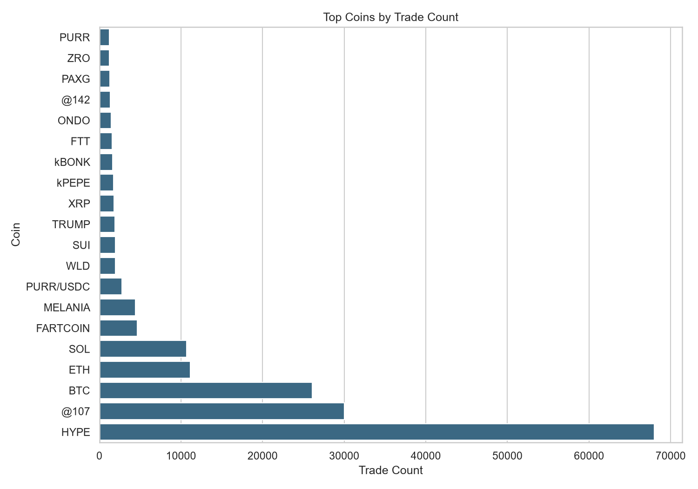

# Bitcoin Market Sentiment and Trader Performance Analysis

An end-to-end data science project that studies how Bitcoin market sentiment relates to trader performance using Hyperliquid historical trading data and the Bitcoin Fear and Greed Index.

The project includes data loading, inspection, cleaning, merging, EDA summaries, static charts, a Streamlit dashboard, and a final written report.

## Project Highlights

- Built a clean Python project structure for a portfolio-ready data science workflow.
- Loaded and inspected two real CSV datasets.
- Created cleaned processed copies without modifying raw data.
- Merged trader records with daily sentiment labels.
- Generated EDA summary reports and visual charts.
- Built a local Streamlit dashboard for interactive exploration.
- Wrote a final Markdown project report.

## Preview Charts

### Trade Count by Sentiment



### Total PnL by Sentiment



### Win Rate by Sentiment



### Top Coins by Trade Count



## Project Structure

```text
bitcoin-trader-sentiment-analysis/
|-- dashboard/
|   `-- app.py
|-- data/
|   |-- raw/
|   `-- processed/
|-- docs/
|   `-- assets/
|-- notebooks/
|   `-- trader_sentiment_analysis.ipynb
|-- outputs/
|   |-- charts/
|   `-- reports/
|-- src/
|   |-- analysis.py
|   |-- data_cleaning.py
|   |-- data_loader.py
|   |-- feature_engineering.py
|   `-- visualization.py
|-- .gitignore
|-- main.py
|-- README.md
`-- requirements.txt
```

## Dataset Files

This repository is packaged to avoid uploading large CSV files by default.

Expected local files:

```text
data/raw/historical_data.csv
data/raw/fear_greed_index.csv
```

Generated processed files:

```text
data/processed/historical_data_cleaned.csv
data/processed/fear_greed_index_cleaned.csv
data/processed/trader_sentiment_merged.csv
```

See [data/README.md](data/README.md) for more detail.

## Main Outputs

EDA reports are saved in:

```text
outputs/reports/
```

Important reports:

- `overall_summary.csv`
- `sentiment_summary.csv`
- `direction_summary.csv`
- `coin_summary.csv`
- `missing_sentiment_summary.csv`
- `final_project_report.md`

Visual charts are saved in:

```text
outputs/charts/
```

Selected chart copies for GitHub preview are stored in:

```text
docs/assets/
```

## Key Descriptive Results

From the final merged dataset:

- Total trades: 211,224
- Unique accounts: 32
- Unique coins: 246
- Total Closed PnL: 10,296,958.94
- Average Closed PnL: 48.75
- Win rate: 41.13%
- Total fees: 245,857.72
- Missing sentiment rows: 6

Among matched sentiment groups, `Extreme Greed` had the highest win rate in this dataset at 46.49%.

These are descriptive findings only. They are not financial advice or trading recommendations.

## Dashboard

Run the Streamlit dashboard from the project root:

```bash
streamlit run dashboard/app.py
```

For Streamlit Community Cloud, use:

```text
streamlit_app.py
```

The dashboard includes:

- Overall metrics
- Sentiment, coin, direction, and date filters
- Filtered trading metrics
- Summary tables
- Chart gallery
- Missing sentiment warning
- Filtered data preview

## Installation

Create a virtual environment:

```bash
python -m venv .venv
```

Activate it on Windows PowerShell:

```powershell
.venv\Scripts\Activate.ps1
```

Install dependencies:

```bash
pip install -r requirements.txt
```

Register a Jupyter kernel:

```bash
python -m ipykernel install --user --name trader-sentiment --display-name "Python (Trader Sentiment)"
```

Start Jupyter Notebook:

```bash
jupyter notebook
```

## Project Phases

- Phase 1: Project setup and folder structure
- Phase 2: Dataset loading and initial inspection
- Phase 3: Data cleaning and preparation
- Phase 4: Dataset merging and analysis-ready data
- Phase 5: Exploratory data analysis summaries
- Phase 6: Visual analysis charts
- Phase 7: Streamlit dashboard
- Phase 8: Final insights and report
- Phase 9: GitHub portfolio packaging

## Limitations

- The analysis is descriptive, not predictive.
- Sentiment data is daily, while trades can occur many times per day.
- Six rows did not match a sentiment date.
- No machine learning model was trained.
- Results depend on the quality and completeness of the provided datasets.

## Status

Phase 9 completed: GitHub portfolio packaging.
